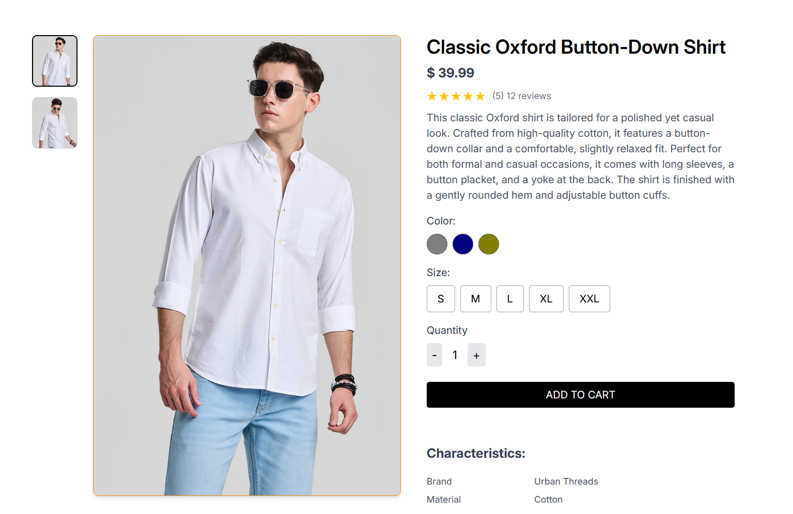
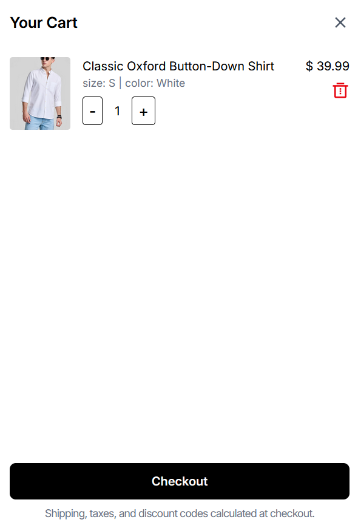

# ShopSphere

**Live Demo:** [shop-sphere](https://github.com/rajat-sharma-3745)  

An e-commerce clothing web app built with full stack components.

---

## 🧩 Table of Contents

- [About](#about)  
- [Features](#features)  
- [Tech Stack](#tech-stack)  
- [Demo / Screenshots](#demo--screenshots)  
- [Getting Started](#getting-started)  
  - [Prerequisites](#prerequisites)  
  - [Installation](#installation)  

---

## About

ShopSphere is a modern, responsive e-commerce clothing application. It features product browsing, categories, user authentication, cart & checkout flows, admin dashboards.

This repository contains two main parts:

- **Frontend** – The client-side React app  
- **Backend** – API server (Express)  

Live version is deployed at [shop-sphere-sable.vercel.app](https://shop-sphere-sable.vercel.app).

---

## Features

- Responsive UI optimized for desktop & mobile  
- Product listing, filtering, and search  
- Product detail pages  
- Shopping cart & checkout  
- User signup / login / profile  
- Order history  
- Admin panel
- Secure API routes 

---

## Tech Stack

| Layer         | Technology                       |
|----------------|-----------------------------------|
| Frontend       | React  |
| Styling / UI   | Tailwind CSS |
| Backend        | Node.js / Express |
| Database       | MongoDB |
| Authentication | JWT |
| Deployment     | Vercel |

---

## Demo & Screenshots

Below are a few screenshots from the live deployed site:

<!-- Replace these with your actual images from your `/assets` or `screenshots` folder -->
  
  
  

---

## Getting Started

### Prerequisites

- Node.js (>= 14.x)  
- npm or yarn  
- A running instance of your database  
- (Optional) .env file with proper credentials  

### Installation
   ```bash
   git clone https://github.com/rajat-sharma-3745/ShopSphere.git
   cd ShopSphere
   cd frontend
   npm install  
   cd ../backend
   npm install
